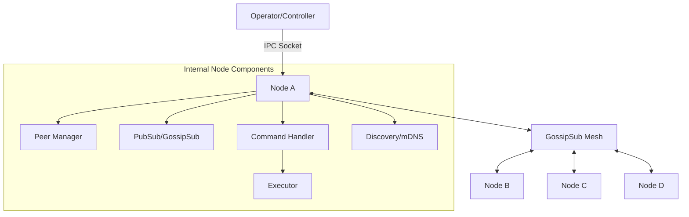

# System Architecture Overview

SkoveNet is a decentralized, peer-to-peer command and control system. It is designed to operate without central infrastructure, utilizing a distributed mesh for message propagation and command execution.

## High-Level Architecture

The system consists of independent nodes that discover each other and form a resilient mesh network. Local interaction with a node is handled via an IPC socket.

## Core Components

### 1. Node Identity & Transport (`pkg/node`)
The `Node` is the primary entry point. It initializes the libp2p host with an **Ed25519** identity and configures the transport stack (TCP and WebSockets). It also manages NAT traversal services like UPnP and AutoNAT.

### 2. Peer Management (`pkg/node/peer_manager.go`)
The `PeerManager` maintains the connectivity state of the node.
*   **Connection Limits**: Enforces a `HighWater` mark of 8 peers and a `LowWater` mark of 4, matching optimized GossipSub parameters.
*   **Callbacks**: Trigger events when peers join or leave the local view, which are forwarded to the controller.

### 3. Messaging & Routing (`pkg/pubsub`, `pkg/protocol`)
SkoveNet uses **GossipSub** for efficient, multi-hop message delivery.
*   **Protocol ID**: `/mesh-c2/1.0.0`
*   **Message Format**: JSON-encoded envelopes containing source/target metadata, TTL for loop prevention, and signed payloads for command authenticity.
*   **Reliability**: Automated deduplication and mesh maintenance ensure message delivery even if specific paths are disrupted.

### 4. Command Pipeline (`pkg/command`)
Incoming messages are routed to the `Handler`, which manages the execution lifecycle.
*   **Validation**: Commands are verified against the operator's public key.
*   **Executor**: A registry-based system that dispatches tasks to specific handlers (e.g., file transfers, process listing, or shell execution).
*   **Asynchronous Responses**: Results are captured and routed back through the mesh to the originating node ID.

### 5. Local Interaction: IPC (`pkg/ipc`)
The `AgentServer` provides a local Unix/Named Pipe socket for controllers (operators) to interact with the local node.
*   **Events**: Real-time notifications for peer connections.
*   **Command Correlation**: Uses unique IDs to map asynchronous P2P responses back to the original local request.

### 6. Discovery (`pkg/discovery`)
Nodes find peers automatically through:
*   **mDNS**: Zero-configuration discovery for local networks.
*   **Peer Exchange**: Propagating peer information through the GossipSub mesh.
